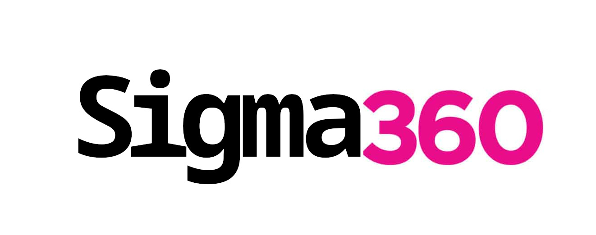

<hr><div align=center>
UQCS Hackathon 2026 Project
</div><hr>

Sigma360 is an app which enables students to watch their Echo360 lectures from the comfort of their terminal. Sigma360 implements a stylish terminal user interface using a miller-column layout that makes browsing courses and lectures feel fast and familiar. Navigate with `hjkl` or the arrow keys, hit enter on a lecture, and it opens straight in mpv — no browser, no tabs, no distractions.

Built in C (with a little help from python) with [notcurses](https://github.com/dankamongmen/notcurses).

## Requirements
- mpv
- cJSON.h

### Build

- CMake
- gcc

### Runtime

- mpv
- cjson
- notcurses
- ffmpeg
- python-requests
- python-playwright

### Arch 

We assume you're on Arch (btw) but this should work on any Linux systems with these dependencies.
```
$ sudo pacman -S mpv cjson notcurses ffmpeg python-requests python-playwright
$ playwright install chromium
```

### Terminal

Sigma360 was tested mostly in Kitty and Konsole, but most modern terminal emulators should do.

## Installation

```
git clone https://github.com/MiiKaa3/Sigma360.git
cd ./Sigma360
cmake -S . -B ./build
cmake --build build
```
You could symlink the binary if you want!

## Usage

Run from the project root:

```sh
./build/sigma360
```

### Navigation

Sigma360 uses a three-pane miller-column layout. You can navigate around, 

| Key | Action |
| --- | --- |
| `j` / `↓` | Move down |
| `k` / `↑` | Move up |
| `l` / `→` | Go forward |
| `h` / `←` | Go back |
| `Enter` | Play selected lecture |
| `s` | Save selected lecture to directory
| `q` | Quit |

Selecting a lecture launches it in mpv. Quitting mpv returns you to the TUI.

<hr><br>
<div align=center>

</align>
